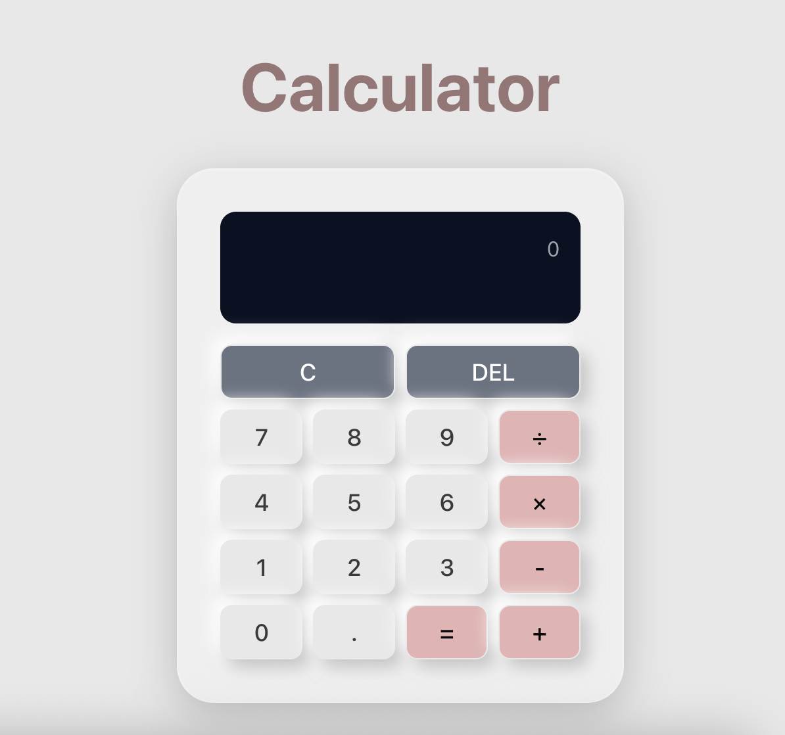

## React Calculator

A awesome calculator implemented with `Vite` and `React`, supporting basic arithmetic operations.



## Quick Start

```bash
git clone git@github.com:weiyupian/vite-react-calculator.git
cd vite-react-calculator
npm install 
npm run dev
```

Visit `http://localhost:5173` to use the calculator.

## ✨ Features

- ➕ **Basic arithmetic operations** (+, -, ×, ÷)
- ➗ **Decimal support**
- 🔄 **Clear/Reset functions**

## 🛠️ Tech Stack

React + Vite + JavaScript + CSS

## Prerequisites

* Node.js **v20.16.0** (tested)
* npm **v10.8.1** (tested)

*Note: These are the versions used for development. Newer versions should also work.*
